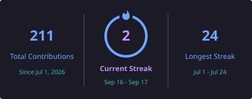
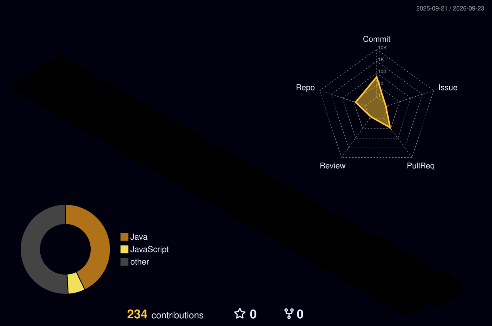

<!-- ========================================================= -->
<!--                    DEEPAK KUMAR                           -->
<!--              GitHub Profile README                        -->
<!-- ========================================================= -->

<div align="center">


<br/>

<a href="https://deepak-java-portfolio.vercel.app">
  
</a>

<a href="https://www.linkedin.com/in/deepak-kumar-56417322a/">
  
</a>

<a href="mailto:deepakdpk0704@gmail.com">
  
</a>

<br/><br/>


</div>

---

<h2 align="center">👨‍💻 About Me</h2>

<div align="center">

<table>
<tr>
<td width="50%" valign="top">

### 🚀 Who I Am

I'm a **Java Full Stack Developer** focused on building scalable and maintainable applications using **Java, Spring Boot, React and PostgreSQL**.

I enjoy working on backend systems, REST APIs, databases and application architecture while continuously improving my problem-solving skills.

</td>

<td width="50%" valign="top">

### 🎯 What I Focus On

```text
☕ Java & OOP
🌱 Spring Boot
⚛️ React
🗄️ PostgreSQL
🔐 REST APIs & Security
🏗️ Microservices
🧪 JUnit & Testing
🐳 Docker
☁️ AWS
🧠 DSA & System Design
```

</td>
</tr>
</table>

</div>

<br>

<h2 align="center">🛠️ Tech Arsenal</h2>

<div align="center">

<table>
<tr>
<td align="center" width="33%">

### ☕ Languages


</td>

<td align="center" width="33%">

### 🌱 Backend


</td>

<td align="center" width="33%">

### ⚛️ Frontend


</td>
</tr>

<tr>
<td align="center" width="33%">

### 🗄️ Databases


</td>

<td align="center" width="33%">

### ☁️ Cloud & DevOps


</td>

<td align="center" width="33%">

### 🧰 Tools


</td>
</tr>
</table>

</div>

<br>

<h2 align="center">🏗️ Engineering Focus</h2>

<div align="center">

<table>
<tr>
<td align="center" width="25%">

### ☕ Backend

Java  
Spring Boot  
Spring MVC  
JPA / Hibernate  
REST APIs

</td>

<td align="center" width="25%">

### ⚛️ Frontend

React.js  
React Router  
Redux Toolkit  
Tailwind CSS

</td>

<td align="center" width="25%">

### 🗄️ Data

PostgreSQL  
MySQL  
H2  
SQL  
Database Design

</td>

<td align="center" width="25%">

### 🏗️ Architecture

Microservices  
Saga Pattern  
Redis  
Docker  
Kubernetes

</td>
</tr>
</table>

</div>

<br>

<h2 align="center">🚀 Featured Projects</h2>

<div align="center">

<table>
<tr>

<td width="33%" valign="top">

<h3 align="center">🎟️ EventNexus</h3>

<p align="center">
<b>Event Management System</b>
</p>

<p>
A full-stack application for managing events and user workflows with a Java-based backend and React frontend.
</p>

<p align="center">


</p>

<p align="center">

<code>REST APIs</code>
<code>JPA</code>
<code>PostgreSQL</code>

</p>

<p align="center">
<a href="https://github.com/deepakkumar9546/EventNexus">

</a>
</p>

</td>

<td width="33%" valign="top">

<h3 align="center">💳 VaultFlow</h3>

<p align="center">
<b>FinTech Banking Application</b>
</p>

<p>
A banking-focused full-stack application built around transaction workflows, APIs, authentication and database persistence.
</p>

<p align="center">


</p>

<p align="center">

<code>REST APIs</code>
<code>JPA</code>
<code>Security</code>

</p>

<p align="center">
<a href="https://github.com/deepakkumar9546/VaultFlow">

</a>
</p>

</td>

<td width="33%" valign="top">

<h3 align="center">🌐 NetPulse</h3>

<p align="center">
<b>Network Monitoring Console</b>
</p>

<p>
A modular Java console application focused on network-oriented operations, exception handling and unit testing.
</p>

<p align="center">


</p>

<p align="center">

<code>Java</code>
<code>Maven</code>
<code>JUnit 5</code>

</p>

<p align="center">
<a href="https://github.com/deepakkumar9546/NetPulse">

</a>
</p>

</td>

</tr>
</table>

</div>

<br>

<h2 align="center">💼 Professional Experience</h2>

<div align="center">

<table>
<tr>
<td width="100%">

<h3>🏢 HCLTech</h3>

<b>Graduate Engineer Trainee</b> · Bengaluru, Karnataka  
<b>September 2025 — Present</b>


During my tenure at HCLTech, I completed structured training focused on the Java Full Stack ecosystem and enterprise software development practices.

<br>

<table>
<tr>
<td align="center" width="25%">

☕  
<b>Java</b>

</td>

<td align="center" width="25%">

🌱  
<b>Spring Boot</b>

</td>

<td align="center" width="25%">

⚛️  
<b>React</b>

</td>

<td align="center" width="25%">

🗄️  
<b>PostgreSQL</b>

</td>
</tr>

<tr>
<td align="center">

🔗  
<b>REST APIs</b>

</td>

<td align="center">

🧩  
<b>JPA</b>

</td>

<td align="center">

🏗️  
<b>Microservices</b>

</td>

<td align="center">

☁️  
<b>Cloud & CI/CD</b>

</td>
</tr>
</table>

</td>
</tr>
</table>

</div>

<br>

<h2 align="center">⚡ GitHub Stats ⚡</h2>

<div align="center">

<table>
<tr>

<td width="50%" align="center">



</td>

<td width="50%" align="center">



</td>

</tr>
</table>

</div>

<br>

<h2 align="center">🏆 GitHub Achievements</h2>

<div align="center">



</div>

<br>

<h2 align="center">🌌 3D Contribution Universe</h2>

<div align="center">



</div>

<br>

<h2 align="center">🐍 Contribution Snake</h2>

<div align="center">

<p>
  Watch the contribution snake move through my GitHub activity.
</p>


</div>

<br>

<h2 align="center">🗺️ Developer Journey</h2>

<div align="center">

<table>
<tr>

<td align="center" width="20%">

### 🎓

<b>2021</b>

<br>

Computer Science  
Engineering

</td>

<td align="center" width="20%">

### ☕

<b>2024</b>

<br>

Java &  
Full Stack Foundations

</td>

<td align="center" width="20%">

### 🌱

<b>2025</b>

<br>

Spring Boot  
React & REST APIs

</td>

<td align="center" width="20%">

### 🏢

<b>2025+</b>

<br>

HCLTech  
Graduate Engineer Trainee

</td>

<td align="center" width="20%">

### 🏗️

<b>Now</b>

<br>

Microservices  
System Design & DSA

</td>

</tr>
</table>

<br>

`Learn` → `Build` → `Solve` → `Design` → `Improve`

</div>

<br>

<h2 align="center">🔭 Currently Exploring</h2>

<div align="center">

<table>
<tr>

<td align="center" width="25%">

### 🏗️

<b>System Design</b>

<br><br>

High-Level Design  
Scalable Systems  
Distributed Architecture

</td>

<td align="center" width="25%">

### 🧩

<b>Low-Level Design</b>

<br><br>

OOP  
Design Patterns  
SOLID Principles

</td>

<td align="center" width="25%">

### ☕

<b>Advanced Java</b>

<br><br>

Collections  
Streams  
Concurrency  
JVM Fundamentals

</td>

<td align="center" width="25%">

### 🧠

<b>Problem Solving</b>

<br><br>

DSA  
Algorithms  
Complexity  
Optimization

</td>

</tr>
</table>

<br>

`Learn` → `Practice` → `Build` → `Design`

</div>

<br>

<h2 align="center">🤝 Let's Connect</h2>

<div align="center">

<p>
I'm always open to connecting with developers, recruiters and people interested in software engineering.
</p>

<br>

<a href="https://deepak-java-portfolio.vercel.app">
  
</a>

<a href="https://github.com/deepakkumar9546">
  
</a>

<a href="https://www.linkedin.com/in/deepak-kumar-56417322a/">
  
</a>

<a href="mailto:deepakdpk0704@gmail.com">
  
</a>

</div>

<br>

<div align="center">

### ☕ Keep Building. Keep Learning. Keep Improving.

`Java` • `Spring Boot` • `React` • `PostgreSQL` • `System Design` • `DSA`

</div>

<br>

<div align="center">


</div>
